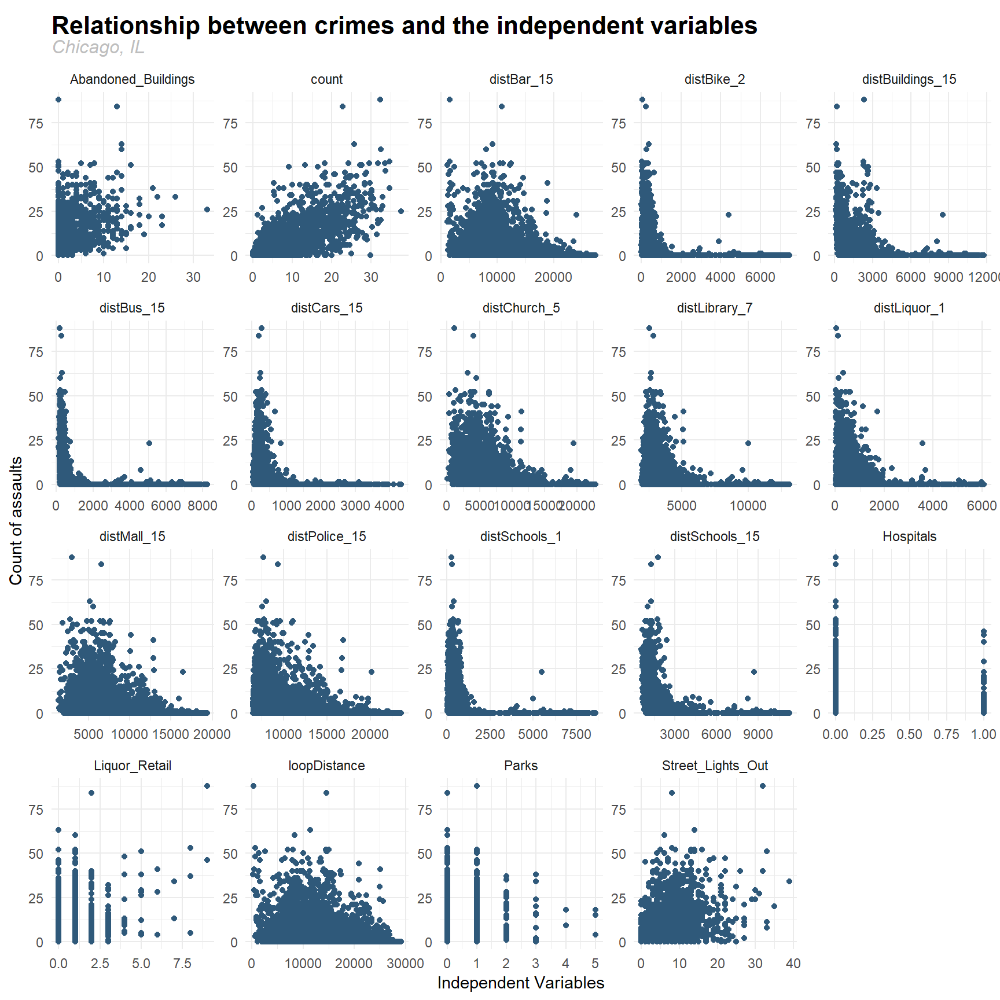
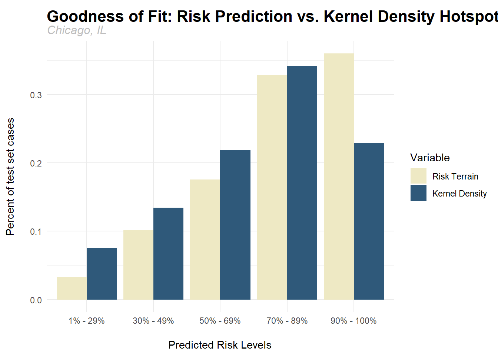

# 0. Setup
This project is one of the assignments in CPLN 590 Spatial Analysis for Urban and Environmental Planning at University of Pennsylvania. I begin by loading the necessary packages and disabling scientific notation in R.


```r
library(tidyverse)
library(sf)
library(QuantPsyc)
library(RSocrata)
library(viridis)
library(FNN)
library(knitr)
library(kableExtra)

options(scipen=999)
```

***

# 1. Data Wrangling
## 1.1. Loading Data
All below code blocks in section 1.1 are used to acquire the independent variables. The first one below shows those that can be directly downloaded from Chicago Data Portal.


```r
abandonCars <-
  read.socrata("https://data.cityofchicago.org/Service-Requests/311-Service-Requests-Abandoned-Vehicles/3c9v-pnva") %>%
  mutate(year = substr(Creation.Date,1,4)) %>%
  filter(year == "2017") %>%
  dplyr::select(Latitude,Longitude, Y = Latitude, X = Longitude) %>%
  na.omit() %>%
  st_as_sf(coords = c("X", "Y"), crs = 4326, agr = "constant") %>%
  st_sf() %>%
  st_transform(st_crs(fishnet)) %>%
  mutate(Legend = "Abandoned_Cars")

abandonBuildings <-
  read.socrata("https://data.cityofchicago.org/Service-Requests/311-Service-Requests-Vacant-and-Abandoned-Building/7nii-7srd") %>%
  mutate(year = substr(DATE.SERVICE.REQUEST.WAS.RECEIVED,1,4)) %>%
  filter(year == "2017") %>%
  dplyr::select(LATITUDE,LONGITUDE, Y = LATITUDE, X = LONGITUDE) %>%
  na.omit() %>%
  st_as_sf(coords = c("X", "Y"), crs = 4326, agr = "constant") %>%
  st_sf() %>%
  st_transform(st_crs(fishnet)) %>%
  mutate(Legend = "Abandoned_Buildings")

streetLightsOut <-
  read.socrata("https://data.cityofchicago.org/Service-Requests/311-Service-Requests-Street-Lights-     All-Out/zuxi-7xem") %>%
  mutate(year = substr(Creation.Date,1,4)) %>%
  filter(year == "2017") %>%
  dplyr::select(Latitude,Longitude, Y = Latitude, X = Longitude) %>%
  na.omit() %>%
  st_as_sf(coords = c("X", "Y"), crs = 4326, agr = "constant") %>%
  st_sf() %>%
  st_transform(st_crs(fishnet)) %>%
  mutate(Legend = "Street_Lights_Out")

liquorRetail <-
  read.socrata("https://data.cityofchicago.org/Community-Economic-Development/Business-Licenses-Cur   rent-Liquor-and-Public-Places/nrmj-3kcf") %>%
  filter(BUSINESS.ACTIVITY == "Retail Sales of Packaged Liquor") %>%
  dplyr::select(LATITUDE,LONGITUDE, Y = LATITUDE, X = LONGITUDE) %>%
  na.omit() %>%
  st_as_sf(coords = c("X", "Y"), crs = 4326, agr = "constant") %>%
  st_sf() %>%
  st_transform(st_crs(fishnet)) %>%
  mutate(Legend = "Liquor_Retail")

police_stations <-
  read.socrata("https://data.cityofchicago.org/resource/gkur-vufi.json") %>%
  dplyr::select(location.latitude, location.longitude, Y = location.latitude, X = location.longitude) %>%
  na.omit() %>%
  st_as_sf(coords = c("X", "Y"), crs = 4326, agr = "constant") %>%
  st_sf() %>%
  st_transform(st_crs(fishnet)) %>%
  mutate(Legend = "Police_Stations")

bike_racks <-
  read.socrata("https://data.cityofchicago.org/Transportation/Bike-Racks/cbyb-69xx") %>%
  dplyr::select(Latitude, Longitude, Y = Latitude, X = Longitude) %>%
  na.omit() %>%
  st_as_sf(coords = c("X", "Y"), crs = 4326, agr = "constant") %>%
  st_sf() %>%
  st_transform(st_crs(fishnet)) %>%
  mutate(Legend = "Bike_Racks")

libraries <-
  read.socrata("https://data.cityofchicago.org/resource/wa2i-tm5d.json") %>%
  dplyr::select(location.latitude, location.longitude, Y = location.latitude, X = location.longitude) %>%
  na.omit() %>%
  st_as_sf(coords = c("X", "Y"), crs = 4326, agr = "constant") %>%
  st_sf() %>%
  st_transform(st_crs(fishnet)) %>%
  mutate(Legend = "Libraries")

park <-
  read.socrata("https://data.cityofchicago.org/resource/2eaw-bdhe.json") %>%
  dplyr::select(location.latitude, location.longitude, Y = location.latitude, X = location.longitude) %>%
  na.omit() %>%
  st_as_sf(coords = c("X", "Y"), crs = 4326, agr = "constant") %>%
  st_sf() %>%
  st_transform(st_crs(fishnet)) %>%
  mutate(Legend = "Parks")

food_inspections <-
  read.socrata("https://data.cityofchicago.org/resource/cnfp-tsxc.json") %>%
  dplyr::select(facility_type, location.latitude, location.longitude, Y = location.latitude, X = location.longitude) %>%
  na.omit() %>%
  st_as_sf(coords = c("X", "Y"), crs = 4326, agr = "constant") %>%
  st_sf() %>%
  st_transform(st_crs(fishnet))

church <-
  food_inspections %>%
  filter(facility_type == 'Church' | facility_type == 'CHURCH') %>%
  dplyr::select() %>%
  mutate(Legend = 'Church')

bar <-
  food_inspections %>%
  filter(facility_type == 'BAR'| facility_type == 'BAR/GRILL' | facility_type == 'bar') %>%
  dplyr::select() %>%
  mutate(Legend = 'Bar')

schools <-
  st_read("https://data.cityofchicago.org/api/geospatial/3fhj-xtn5?method=export&format=GeoJSON") %>%
  st_transform(st_crs(fishnet))

neighborhoods <-
  st_read("https://raw.githubusercontent.com/blackmad/neighborhoods/master/chicago.geojson") %>%
  st_transform(st_crs(fishnet)) %>%
  dplyr::select(name)
```

There are a few layers whose GeoJSON is not accessible. Hence I first download their shapefiles, and then import them into R.

```r
bus_stops <-
  st_read('CTA_BusStops.shp') %>%
  mutate(Legend = 'Bus_Stops') %>%
  dplyr::select(., "Legend", "geometry") %>%
  st_transform(st_crs(fishnet))

malls_plazas <-
  st_read('mall_plaza.shp') %>%
  st_centroid(.) %>%
  mutate(Legend = 'Malls_Plazas') %>%
  dplyr::select(., "Legend", "geometry") %>%
  st_transform(st_crs(fishnet))
```

This very last one is the average number of crimes from nearest 8 grid cells. I use the Generate Near Table as well as Summarize functions in ArcGIS to calculate this feature, export a .txt file, and import it into R.

```r
nearest_crimes <-
  read.csv("Avg8Grids.txt") %>%
  mutate(uniqueID = IN_FID + 1) %>%
  dplyr::select(uniqueID, Ave_COUNT, count = Ave_COUNT)
```


## 1.2. Calculating number of objects in grids
Regarding abandoned buildings, hospitals, liquor retails, parks, and 311 reports for street lights that are out, the following codes will count the number of each of them in every grid.

```r
allVars.sf <-
  rbind(abandonBuildings, hospitals, liquorRetail, park, streetLightsOut)

vars_net <-
  st_join(allVars.sf, fishnet, join=st_within) %>%
  as.data.frame() %>%
  group_by(uniqueID, Legend) %>%
  summarize(count = n()) %>%
  full_join(fishnet) %>%
  spread(Legend, count, fill=0) %>%
  st_sf() %>%
  na.omit()
```


## 1.3. Measuring average nearest distance
As for schools, abandoned cars, abandoned buildings, bars, police stations, bike racks, hospitals, malls and plazas, churches, and libraries, I first extract their XY coordinates (crs = 102271), which will be used to measure the average distance from the centroid of each grid to certain number of nearest objects.

```r
vars_net.xy <-
  st_centroid(vars_net) %>%
  cbind(.,st_coordinates(st_centroid(vars_net))) %>%
  st_set_geometry(NULL) %>%
  dplyr::select(X,Y) %>%
  as.matrix()

schools.xy <-
  schools %>%
  cbind(.,st_coordinates(st_centroid(schools)))  %>%
  st_set_geometry(NULL) %>%
  dplyr::select(X,Y) %>%
  as.matrix()

abandonCars.xy <-
  abandonCars %>%
  cbind(.,st_coordinates(st_centroid(abandonCars)))  %>%
  st_set_geometry(NULL) %>%
  dplyr::select(X,Y) %>%
  as.matrix()

abandonBuildings.xy <-
  abandonBuildings %>%
  cbind(.,st_coordinates(st_centroid(abandonBuildings)))  %>%
  st_set_geometry(NULL) %>%
  dplyr::select(X,Y) %>%
  as.matrix()

bar.xy <-
  bar %>%
  cbind(.,st_coordinates(st_centroid(bar)))  %>%
  st_set_geometry(NULL) %>%
  dplyr::select(X,Y) %>%
  as.matrix()

bus_stops.xy <-
  bus_stops %>%
  cbind(.,st_coordinates(st_centroid(bus_stops)))  %>%
  st_set_geometry(NULL) %>%
  dplyr::select(X,Y) %>%
  as.matrix()

police_stations.xy <-
  police_stations %>%
  cbind(.,st_coordinates(st_centroid(police_stations)))  %>%
  st_set_geometry(NULL) %>%
  dplyr::select(X,Y) %>%
  as.matrix()

bike_racks.xy <-
  bike_racks %>%
  cbind(.,st_coordinates(st_centroid(bike_racks)))  %>%
  st_set_geometry(NULL) %>%
  dplyr::select(X,Y) %>%
  as.matrix()

hospitals.xy <-
  hospitals %>%
  cbind(.,st_coordinates(st_centroid(hospitals)))  %>%
  st_set_geometry(NULL) %>%
  dplyr::select(X,Y) %>%
  as.matrix()

malls_plazas.xy <-
  malls_plazas %>%
  cbind(.,st_coordinates(st_centroid(malls_plazas)))  %>%
  st_set_geometry(NULL) %>%
  dplyr::select(X,Y) %>%
  as.matrix()

church.xy <-
  church %>%
  cbind(.,st_coordinates(st_centroid(church)))  %>%
  st_set_geometry(NULL) %>%
  dplyr::select(X,Y) %>%
  as.matrix()

library.xy <-
  libraries %>%
  cbind(.,st_coordinates(st_centroid(libraries)))  %>%
  st_set_geometry(NULL) %>%
  dplyr::select(X,Y) %>%
  as.matrix()
```

The code block below calculates the average distance to nearest 15 bars, 2 bike racks, 15 abandoned buildings, 15 bus stops, 15 abandoned cars, 5 churches, 7 libraries, 1 liquor retail location, 15 malls and plazas, 15 police stations, and 1 and 15 schools, respectively.

```r
distBar_15 <-
  as.data.frame(nn_function(vars_net.xy, bar.xy, 15)) %>%
  rename(distBar_15=pointDistance)

distBike_2 <-
  as.data.frame(nn_function(vars_net.xy, bike_racks.xy, 2)) %>%
  rename(distBike_2=pointDistance)

distBuilding_15 <-
  as.data.frame(nn_function(vars_net.xy, abandonBuildings.xy, 15)) %>%
  rename(distBuildings_15=pointDistance)

distBus_15 <-
  as.data.frame(nn_function(vars_net.xy, bus_stops.xy, 15)) %>%
  rename(distBus_15=pointDistance)

distCar_15 <-
  as.data.frame(nn_function(vars_net.xy, abandonCars.xy, 15)) %>%
  rename(distCars_15=pointDistance)

distChurch_5 <-
  as.data.frame(nn_function(vars_net.xy, church.xy, 5)) %>%
  rename(distChurch_5=pointDistance)

distLibrary_7 <-
  as.data.frame(nn_function(vars_net.xy, library.xy, 7)) %>%
  rename(distLibrary_7=pointDistance)

distLiquor_1 <-
  as.data.frame(nn_function(vars_net.xy, liquorRetail.xy, 1)) %>%
  rename(distLiquor_1=pointDistance)

distMall_15 <-
  as.data.frame(nn_function(vars_net.xy, malls_plazas.xy, 15)) %>%
  rename(distMall_15=pointDistance)

distPolice_15 <-
  as.data.frame(nn_function(vars_net.xy, police_stations.xy, 15)) %>%
  rename(distPolice_15=pointDistance)

distSchool_1 <-
  as.data.frame(nn_function(vars_net.xy,schools.xy,1)) %>%
  rename(distSchools_1=pointDistance)

distSchool_15 <-
  as.data.frame(nn_function(vars_net.xy,schools.xy,15)) %>%
  rename(distSchools_15=pointDistance)
```

At last, I perform 'column bind' towards the original vars_net dataframe, and the distances generated above.

```r
vars_net <-
  cbind(as.data.frame(vars_net), distBar_15, distBike_2, distBuilding_15,
        distBus_15, distCar_15, distChurch_5, distLibrary_7, distLiquor_1,
        distMall_15, distPolice_15, distSchool_1, distSchool_15) %>%
  st_sf()
```

## 1.4. Calculating distance to Loop
The next explanatory variable is distance to Loop.

```r
loopPoint <-
  neighborhoods %>%
  filter(name == "Loop") %>%
  st_centroid()

vars_net$loopDistance <-
  st_distance(st_centroid(vars_net),loopPoint) %>%
  as.numeric()
```


## 1.5. Joining nearest crimes
The last independent variable is average number of crimes of the nearest 8 grids. I join "vars_net" with "nearest_crimes" by their uniqueID here.

```r
vars_net <-
  vars_net %>%
  left_join(nearest_crimes, by = c("uniqueID"))
```


## 1.6. Creating the final net
The final step for data wrangling is to join our independent variables back to crime_net, which contains the number of assaults in each grid (our dependent variable). The first 6 rows of final net are illustrated below.

```r
final_net <-
  left_join(crime_net,data.frame(vars_net), by="uniqueID") %>%
  dplyr::select(-geometry,-geometry.y)

head(final_net %>%
       st_set_geometry(NULL) %>%
       dplyr::select(-X.NA.)) %>%
  kable(caption = 'First 6 rows of dataset') %>%
  kable_styling("striped",
                full_width = F,
                font_size = 15) %>%
  row_spec(seq(1, 6, 2), bold = F, color = "white", background = "#2f597a")
```

<table class="table table-striped" style="font-size: 15px; width: auto !important; margin-left: auto; margin-right: auto;">
<caption style="font-size: initial !important;">First 6 rows of dataset</caption>
 <thead>
  <tr>
   <th style="text-align:right;"> countAssaults </th>
   <th style="text-align:right;"> uniqueID </th>
   <th style="text-align:right;"> Abandoned_Buildings </th>
   <th style="text-align:right;"> Hospitals </th>
   <th style="text-align:right;"> Liquor_Retail </th>
   <th style="text-align:right;"> Parks </th>
   <th style="text-align:right;"> Street_Lights_Out </th>
   <th style="text-align:right;"> distBar_15 </th>
   <th style="text-align:right;"> distBike_2 </th>
   <th style="text-align:right;"> distBuildings_15 </th>
   <th style="text-align:right;"> distBus_15 </th>
   <th style="text-align:right;"> distCars_15 </th>
   <th style="text-align:right;"> distChurch_5 </th>
   <th style="text-align:right;"> distLibrary_7 </th>
   <th style="text-align:right;"> distLiquor_1 </th>
   <th style="text-align:right;"> distMall_15 </th>
   <th style="text-align:right;"> distPolice_15 </th>
   <th style="text-align:right;"> distSchools_1 </th>
   <th style="text-align:right;"> distSchools_15 </th>
   <th style="text-align:right;"> loopDistance </th>
   <th style="text-align:right;"> count </th>
  </tr>
 </thead>
<tbody>
  <tr>
   <td style="text-align:right;color: white;background-color: #2f597a;"> 5 </td>
   <td style="text-align:right;color: white;background-color: #2f597a;"> 1 </td>
   <td style="text-align:right;color: white;background-color: #2f597a;"> 1 </td>
   <td style="text-align:right;color: white;background-color: #2f597a;"> 0 </td>
   <td style="text-align:right;color: white;background-color: #2f597a;"> 0 </td>
   <td style="text-align:right;color: white;background-color: #2f597a;"> 0 </td>
   <td style="text-align:right;color: white;background-color: #2f597a;"> 5 </td>
   <td style="text-align:right;color: white;background-color: #2f597a;"> 19527.03 </td>
   <td style="text-align:right;color: white;background-color: #2f597a;"> 1544.7738 </td>
   <td style="text-align:right;color: white;background-color: #2f597a;"> 1000.975 </td>
   <td style="text-align:right;color: white;background-color: #2f597a;"> 1303.895 </td>
   <td style="text-align:right;color: white;background-color: #2f597a;"> 762.8130 </td>
   <td style="text-align:right;color: white;background-color: #2f597a;"> 12267.66 </td>
   <td style="text-align:right;color: white;background-color: #2f597a;"> 5801.692 </td>
   <td style="text-align:right;color: white;background-color: #2f597a;"> 603.8920 </td>
   <td style="text-align:right;color: white;background-color: #2f597a;"> 13819.71 </td>
   <td style="text-align:right;color: white;background-color: #2f597a;"> 17536.24 </td>
   <td style="text-align:right;color: white;background-color: #2f597a;"> 766.5012 </td>
   <td style="text-align:right;color: white;background-color: #2f597a;"> 2825.503 </td>
   <td style="text-align:right;color: white;background-color: #2f597a;"> 25923.34 </td>
   <td style="text-align:right;color: white;background-color: #2f597a;"> 6.000 </td>
  </tr>
  <tr>
   <td style="text-align:right;"> 0 </td>
   <td style="text-align:right;"> 2 </td>
   <td style="text-align:right;"> 0 </td>
   <td style="text-align:right;"> 0 </td>
   <td style="text-align:right;"> 0 </td>
   <td style="text-align:right;"> 0 </td>
   <td style="text-align:right;"> 0 </td>
   <td style="text-align:right;"> 19625.91 </td>
   <td style="text-align:right;"> 1347.8658 </td>
   <td style="text-align:right;"> 1055.935 </td>
   <td style="text-align:right;"> 1142.563 </td>
   <td style="text-align:right;"> 781.2525 </td>
   <td style="text-align:right;"> 12281.40 </td>
   <td style="text-align:right;"> 5777.549 </td>
   <td style="text-align:right;"> 873.0705 </td>
   <td style="text-align:right;"> 13764.71 </td>
   <td style="text-align:right;"> 17606.24 </td>
   <td style="text-align:right;"> 834.2676 </td>
   <td style="text-align:right;"> 2830.947 </td>
   <td style="text-align:right;"> 25947.48 </td>
   <td style="text-align:right;"> 3.500 </td>
  </tr>
  <tr>
   <td style="text-align:right;color: white;background-color: #2f597a;"> 0 </td>
   <td style="text-align:right;color: white;background-color: #2f597a;"> 3 </td>
   <td style="text-align:right;color: white;background-color: #2f597a;"> 0 </td>
   <td style="text-align:right;color: white;background-color: #2f597a;"> 0 </td>
   <td style="text-align:right;color: white;background-color: #2f597a;"> 0 </td>
   <td style="text-align:right;color: white;background-color: #2f597a;"> 0 </td>
   <td style="text-align:right;color: white;background-color: #2f597a;"> 0 </td>
   <td style="text-align:right;color: white;background-color: #2f597a;"> 19745.46 </td>
   <td style="text-align:right;color: white;background-color: #2f597a;"> 1043.8655 </td>
   <td style="text-align:right;color: white;background-color: #2f597a;"> 1307.674 </td>
   <td style="text-align:right;color: white;background-color: #2f597a;"> 1045.048 </td>
   <td style="text-align:right;color: white;background-color: #2f597a;"> 971.5247 </td>
   <td style="text-align:right;color: white;background-color: #2f597a;"> 12314.25 </td>
   <td style="text-align:right;color: white;background-color: #2f597a;"> 5744.394 </td>
   <td style="text-align:right;color: white;background-color: #2f597a;"> 1293.7248 </td>
   <td style="text-align:right;color: white;background-color: #2f597a;"> 13718.13 </td>
   <td style="text-align:right;color: white;background-color: #2f597a;"> 17697.41 </td>
   <td style="text-align:right;color: white;background-color: #2f597a;"> 712.0576 </td>
   <td style="text-align:right;color: white;background-color: #2f597a;"> 2885.402 </td>
   <td style="text-align:right;color: white;background-color: #2f597a;"> 25982.62 </td>
   <td style="text-align:right;color: white;background-color: #2f597a;"> 2.000 </td>
  </tr>
  <tr>
   <td style="text-align:right;"> 0 </td>
   <td style="text-align:right;"> 4 </td>
   <td style="text-align:right;"> 0 </td>
   <td style="text-align:right;"> 0 </td>
   <td style="text-align:right;"> 0 </td>
   <td style="text-align:right;"> 0 </td>
   <td style="text-align:right;"> 0 </td>
   <td style="text-align:right;"> 19878.30 </td>
   <td style="text-align:right;"> 928.8354 </td>
   <td style="text-align:right;"> 1681.970 </td>
   <td style="text-align:right;"> 1118.200 </td>
   <td style="text-align:right;"> 1178.4108 </td>
   <td style="text-align:right;"> 12366.90 </td>
   <td style="text-align:right;"> 5744.009 </td>
   <td style="text-align:right;"> 1756.8766 </td>
   <td style="text-align:right;"> 13686.27 </td>
   <td style="text-align:right;"> 17805.22 </td>
   <td style="text-align:right;"> 793.3211 </td>
   <td style="text-align:right;"> 2984.818 </td>
   <td style="text-align:right;"> 26028.00 </td>
   <td style="text-align:right;"> 0.875 </td>
  </tr>
  <tr>
   <td style="text-align:right;color: white;background-color: #2f597a;"> 0 </td>
   <td style="text-align:right;color: white;background-color: #2f597a;"> 5 </td>
   <td style="text-align:right;color: white;background-color: #2f597a;"> 0 </td>
   <td style="text-align:right;color: white;background-color: #2f597a;"> 0 </td>
   <td style="text-align:right;color: white;background-color: #2f597a;"> 0 </td>
   <td style="text-align:right;color: white;background-color: #2f597a;"> 0 </td>
   <td style="text-align:right;color: white;background-color: #2f597a;"> 0 </td>
   <td style="text-align:right;color: white;background-color: #2f597a;"> 20020.03 </td>
   <td style="text-align:right;color: white;background-color: #2f597a;"> 1062.5567 </td>
   <td style="text-align:right;color: white;background-color: #2f597a;"> 2069.794 </td>
   <td style="text-align:right;color: white;background-color: #2f597a;"> 1362.108 </td>
   <td style="text-align:right;color: white;background-color: #2f597a;"> 1412.9779 </td>
   <td style="text-align:right;color: white;background-color: #2f597a;"> 12435.74 </td>
   <td style="text-align:right;color: white;background-color: #2f597a;"> 5788.614 </td>
   <td style="text-align:right;color: white;background-color: #2f597a;"> 2234.0202 </td>
   <td style="text-align:right;color: white;background-color: #2f597a;"> 13666.26 </td>
   <td style="text-align:right;color: white;background-color: #2f597a;"> 17925.55 </td>
   <td style="text-align:right;color: white;background-color: #2f597a;"> 1035.8916 </td>
   <td style="text-align:right;color: white;background-color: #2f597a;"> 3160.690 </td>
   <td style="text-align:right;color: white;background-color: #2f597a;"> 26079.69 </td>
   <td style="text-align:right;color: white;background-color: #2f597a;"> 0.125 </td>
  </tr>
  <tr>
   <td style="text-align:right;"> 0 </td>
   <td style="text-align:right;"> 6 </td>
   <td style="text-align:right;"> 0 </td>
   <td style="text-align:right;"> 0 </td>
   <td style="text-align:right;"> 0 </td>
   <td style="text-align:right;"> 0 </td>
   <td style="text-align:right;"> 0 </td>
   <td style="text-align:right;"> 20173.85 </td>
   <td style="text-align:right;"> 1330.0457 </td>
   <td style="text-align:right;"> 2411.665 </td>
   <td style="text-align:right;"> 1721.405 </td>
   <td style="text-align:right;"> 1708.5361 </td>
   <td style="text-align:right;"> 12524.10 </td>
   <td style="text-align:right;"> 5865.100 </td>
   <td style="text-align:right;"> 2721.0400 </td>
   <td style="text-align:right;"> 13660.76 </td>
   <td style="text-align:right;"> 18061.59 </td>
   <td style="text-align:right;"> 1148.8105 </td>
   <td style="text-align:right;"> 3394.431 </td>
   <td style="text-align:right;"> 26140.79 </td>
   <td style="text-align:right;"> 0.000 </td>
  </tr>
</tbody>
</table>

***

# 2. Exploratory Analysis
Below shows a multi-scatterplot visualization that displays the relationship between the dependent variable and independent variables. Overall, the degree to which average number of crimes of nearest 8 grids is associated with the dependent variable is the highest.

```r
final_net_long <-
  final_net %>%
  gather(Variable, Value, -countAssaults, -uniqueID, -X.NA., -geometry.x)

ggplot(data = final_net_long, aes(x = Value, y = countAssaults)) +
  geom_point(color = "#2f597a") +
  facet_wrap(~Variable, scales="free") +
  labs(title="Relationship between crimes and the independent variables",
       subtitle='Chicago, IL',
       x="Independent Variables",
       y="Count of assaults") +
  theme_minimal() +
  theme(plot.title=element_text(size=16, face="bold", vjust=-1),
        plot.subtitle=element_text(size=12, face="italic", color="grey"))
```



***

# 3. Estimating models
## 3.1. Estimating regression
Again, the independent variables used here include the number of abandoned buildings, hospitals, liquor retail locations, parks, street lights that are out; distance to nearest 15 bars, 2 bike racks, 15 abandoned buildings, 15 bus stops, 15 abandoned cars, 5 churches, 7 libraries, 1 liquor retail location, 15 malls and plazas, 15 police stations, 1 and 15 schools; distance to Loop, and average number of crimes of nearest 8 gridcells.

The regression model estimates are detailed below. We can see that except for the number of hospitals, all independent variables are significant at 99.9% confidence level.


```r
reg1 <- glm(countAssaults ~ ., family = "poisson",
            data= final_net %>%
              as.data.frame %>%
              dplyr::select(-uniqueID, -X.NA., -geometry.x
              ))

summary(reg1)
```

```
##
## Call:
## glm(formula = countAssaults ~ ., family = "poisson", data = final_net %>%
##     as.data.frame %>% dplyr::select(-uniqueID, -X.NA., -geometry.x))
##
## Deviance Residuals:
##     Min       1Q   Median       3Q      Max  
## -6.5608  -1.4389  -0.4668   0.4600  23.0159  
##
## Coefficients:
##                       Estimate Std. Error z value Pr(>|z|)    
## (Intercept)          1.823e+00  5.685e-02  32.075  < 2e-16 ***
## Abandoned_Buildings  2.668e-02  2.090e-03  12.770  < 2e-16 ***
## Hospitals            1.447e-01  4.622e-02   3.130 0.001749 **
## Liquor_Retail        1.266e-01  7.303e-03  17.328  < 2e-16 ***
## Parks                8.469e-02  1.193e-02   7.100 1.24e-12 ***
## Street_Lights_Out    1.347e-02  1.258e-03  10.707  < 2e-16 ***
## distBar_15           8.174e-05  1.558e-05   5.246 1.56e-07 ***
## distBike_2          -6.032e-04  5.403e-05 -11.164  < 2e-16 ***
## distBuildings_15    -1.510e-04  2.039e-05  -7.405 1.31e-13 ***
## distBus_15          -7.354e-04  7.499e-05  -9.807  < 2e-16 ***
## distCars_15         -1.199e-03  7.668e-05 -15.638  < 2e-16 ***
## distChurch_5        -8.662e-05  1.284e-05  -6.746 1.52e-11 ***
## distLibrary_7        1.186e-04  2.805e-05   4.227 2.37e-05 ***
## distLiquor_1        -1.112e-04  3.274e-05  -3.397 0.000682 ***
## distMall_15          5.592e-05  1.197e-05   4.672 2.99e-06 ***
## distPolice_15        9.450e-05  1.320e-05   7.159 8.14e-13 ***
## distSchools_1       -3.467e-04  4.050e-05  -8.559  < 2e-16 ***
## distSchools_15      -3.123e-04  3.175e-05  -9.836  < 2e-16 ***
## loopDistance        -7.198e-05  1.004e-05  -7.168 7.63e-13 ***
## count                4.826e-02  1.231e-03  39.209  < 2e-16 ***
## ---
## Signif. codes:  0 '***' 0.001 '**' 0.01 '*' 0.05 '.' 0.1 ' ' 1
##
## (Dispersion parameter for poisson family taken to be 1)
##
##     Null deviance: 28873.3  on 2659  degrees of freedom
## Residual deviance:  9177.4  on 2640  degrees of freedom
## AIC: 16330
##
## Number of Fisher Scoring iterations: 7
```


## 3.2. Standardized regression coefficients
Next, we calculate standardized regression coefficients of each independent variable in order to see which of them contributes most to our model. Illustrated by the following table and histogram, distance to nearest 15 bus stops, 15 abandoned cars, 2 bike racks, 15 schools, and distance to Loop become the top 5.

```r
standardized1 <- as.data.frame(lm.beta(reg1))
standardized1$variable <- row.names(standardized1)
colnames(standardized1)[1] <- "std_coefficient"
standardized1$absCoef <- abs(standardized1$std_coefficient)

standardized1[,c(1,3)] %>%
  kable(caption = 'Absolute Standardized Regression Coefficients') %>%
  kable_styling("striped",
                full_width = F,
                font_size = 15) %>%
  row_spec(seq(1, 19, 2), bold = F, color = "white", background = "#2f597a")
```

<table class="table table-striped" style="font-size: 15px; width: auto !important; margin-left: auto; margin-right: auto;">
<caption style="font-size: initial !important;">Absolute Standardized Regression Coefficients</caption>
 <thead>
  <tr>
   <th style="text-align:left;">   </th>
   <th style="text-align:right;"> std_coefficient </th>
   <th style="text-align:right;"> absCoef </th>
  </tr>
 </thead>
<tbody>
  <tr>
   <td style="text-align:left;color: white;background-color: #2f597a;"> Abandoned_Buildings </td>
   <td style="text-align:right;color: white;background-color: #2f597a;"> 0.0083088 </td>
   <td style="text-align:right;color: white;background-color: #2f597a;"> 0.0083088 </td>
  </tr>
  <tr>
   <td style="text-align:left;"> Hospitals </td>
   <td style="text-align:right;"> 0.0018408 </td>
   <td style="text-align:right;"> 0.0018408 </td>
  </tr>
  <tr>
   <td style="text-align:left;color: white;background-color: #2f597a;"> Liquor_Retail </td>
   <td style="text-align:right;color: white;background-color: #2f597a;"> 0.0109726 </td>
   <td style="text-align:right;color: white;background-color: #2f597a;"> 0.0109726 </td>
  </tr>
  <tr>
   <td style="text-align:left;"> Parks </td>
   <td style="text-align:right;"> 0.0044320 </td>
   <td style="text-align:right;"> 0.0044320 </td>
  </tr>
  <tr>
   <td style="text-align:left;color: white;background-color: #2f597a;"> Street_Lights_Out </td>
   <td style="text-align:right;color: white;background-color: #2f597a;"> 0.0075995 </td>
   <td style="text-align:right;color: white;background-color: #2f597a;"> 0.0075995 </td>
  </tr>
  <tr>
   <td style="text-align:left;"> distBar_15 </td>
   <td style="text-align:right;"> 0.0440891 </td>
   <td style="text-align:right;"> 0.0440891 </td>
  </tr>
  <tr>
   <td style="text-align:left;color: white;background-color: #2f597a;"> distBike_2 </td>
   <td style="text-align:right;color: white;background-color: #2f597a;"> -0.0674320 </td>
   <td style="text-align:right;color: white;background-color: #2f597a;"> 0.0674320 </td>
  </tr>
  <tr>
   <td style="text-align:left;"> distBuildings_15 </td>
   <td style="text-align:right;"> -0.0302535 </td>
   <td style="text-align:right;"> 0.0302535 </td>
  </tr>
  <tr>
   <td style="text-align:left;color: white;background-color: #2f597a;"> distBus_15 </td>
   <td style="text-align:right;color: white;background-color: #2f597a;"> -0.0905730 </td>
   <td style="text-align:right;color: white;background-color: #2f597a;"> 0.0905730 </td>
  </tr>
  <tr>
   <td style="text-align:left;"> distCars_15 </td>
   <td style="text-align:right;"> -0.0694329 </td>
   <td style="text-align:right;"> 0.0694329 </td>
  </tr>
  <tr>
   <td style="text-align:left;color: white;background-color: #2f597a;"> distChurch_5 </td>
   <td style="text-align:right;color: white;background-color: #2f597a;"> -0.0389487 </td>
   <td style="text-align:right;color: white;background-color: #2f597a;"> 0.0389487 </td>
  </tr>
  <tr>
   <td style="text-align:left;"> distLibrary_7 </td>
   <td style="text-align:right;"> 0.0225029 </td>
   <td style="text-align:right;"> 0.0225029 </td>
  </tr>
  <tr>
   <td style="text-align:left;color: white;background-color: #2f597a;"> distLiquor_1 </td>
   <td style="text-align:right;color: white;background-color: #2f597a;"> -0.0097708 </td>
   <td style="text-align:right;color: white;background-color: #2f597a;"> 0.0097708 </td>
  </tr>
  <tr>
   <td style="text-align:left;"> distMall_15 </td>
   <td style="text-align:right;"> 0.0208475 </td>
   <td style="text-align:right;"> 0.0208475 </td>
  </tr>
  <tr>
   <td style="text-align:left;color: white;background-color: #2f597a;"> distPolice_15 </td>
   <td style="text-align:right;color: white;background-color: #2f597a;"> 0.0358393 </td>
   <td style="text-align:right;color: white;background-color: #2f597a;"> 0.0358393 </td>
  </tr>
  <tr>
   <td style="text-align:left;"> distSchools_1 </td>
   <td style="text-align:right;"> -0.0456078 </td>
   <td style="text-align:right;"> 0.0456078 </td>
  </tr>
  <tr>
   <td style="text-align:left;color: white;background-color: #2f597a;"> distSchools_15 </td>
   <td style="text-align:right;color: white;background-color: #2f597a;"> -0.0586158 </td>
   <td style="text-align:right;color: white;background-color: #2f597a;"> 0.0586158 </td>
  </tr>
  <tr>
   <td style="text-align:left;"> loopDistance </td>
   <td style="text-align:right;"> -0.0475105 </td>
   <td style="text-align:right;"> 0.0475105 </td>
  </tr>
  <tr>
   <td style="text-align:left;color: white;background-color: #2f597a;"> count </td>
   <td style="text-align:right;color: white;background-color: #2f597a;"> 0.0356276 </td>
   <td style="text-align:right;color: white;background-color: #2f597a;"> 0.0356276 </td>
  </tr>
</tbody>
</table>


```r
ggplot(standardized1, aes(x=reorder(variable,-absCoef), y=absCoef, fill=variable)) +
  geom_bar(stat="identity") +
  labs(title="Absolute Standardized Coefficients of Independent Variables",
       subtitle='Chicago, IL',
       x="Independent Variables",
       y="Absolute standardized coefficients") +
  theme_minimal() +
  theme(plot.title=element_text(size=17, face="bold", vjust=-1)) +
  theme(plot.subtitle=element_text(size=12, face="italic", color="grey")) +
  theme(axis.text.x = element_text(angle = 90, hjust = 1)) +
  theme(legend.position='none')
```


## 3.3. Predicted assault risk in Chicago
Below is a map showing predicted assault risk in the city of Chicago. We can notice there exists a hot spot located within the Loop, where the predicted assault risk is the highest. In addition, the distribution of predicted assaults looks similar to the existing conditions shown in the in-class demo.

```r
ggplot() +
  geom_sf(data=cbind(fishnet,reg1$fitted.values), aes(fill=reg1.fitted.values), colour=NA) +
  labs(title= "Predicted Assault Risk",
       subtitle = 'Chicago, IL') +
  scale_fill_viridis(option = "E",
                     name = '# of predicted assaults') +
  theme_minimal() +
  theme(axis.text = element_blank(),
        panel.border = element_rect(colour = "grey", fill=NA, size=0.5),
        plot.title=element_text(size=17, face="bold", vjust=-1),
        plot.subtitle=element_text(size=12, face="italic", color="grey"))
```


## 3.4. Average predicted risk by police beat
The codes below are utilized to create a map of average predicted risk by police beat that we could give to the police working in different areas. Generally speaking, the most dangerous police beats are located in the Loop, West Chicago, and South Chicago.

```r
police_Beats <-
  st_read("https://data.cityofchicago.org/api/geospatial/aerh-rz74?method=export&format=GeoJSON") %>%
  st_transform(crs=102271)

Beat_w_Crimes <-
  cbind(final_net, reg1$fitted.values) %>%
  st_join(police_Beats, .) %>%
  as.data.frame() %>%
  group_by(beat_num) %>%
  summarize(avg_crimes = mean(reg1.fitted.values)) %>%
  full_join(police_Beats) %>%
  st_sf() %>%
  na.omit()
```


```r
ggplot() +
  geom_sf(data=Beat_w_Crimes, aes(fill=avg_crimes)) +
  scale_fill_viridis(option = "E",
                     name = '# of predicted assaults') +
  labs(title= "Average Predicted Assaults by Police Beats",
       subtitle = 'Chicago, IL') +
  theme_minimal() +
  theme(axis.text = element_blank(),
        panel.border = element_rect(colour = "grey", fill=NA, size=0.5),
        plot.title=element_text(size=17, face="bold", vjust=-1),
        plot.subtitle=element_text(size=12, face="italic", color="grey"))
```


```r
Beat_w_Crimes[order(Beat_w_Crimes$avg_crimes, decreasing = TRUE), ] %>%
  st_set_geometry(NULL) %>%
  head(10) %>%
  kable(caption = 'Top 10 police beats with most predicted assaults') %>%
  kable_styling("striped",
                full_width = F,
                font_size = 15) %>%
  row_spec(seq(1, 10, 2), bold = F, color = "white", background = "#2f597a")
```

<table class="table table-striped" style="font-size: 15px; width: auto !important; margin-left: auto; margin-right: auto;">
<caption style="font-size: initial !important;">Top 10 police beats with most predicted assaults</caption>
 <thead>
  <tr>
   <th style="text-align:left;"> beat_num </th>
   <th style="text-align:right;"> avg_crimes </th>
   <th style="text-align:left;"> beat </th>
   <th style="text-align:left;"> district </th>
   <th style="text-align:left;"> sector </th>
  </tr>
 </thead>
<tbody>
  <tr>
   <td style="text-align:left;color: white;background-color: #2f597a;"> 0112 </td>
   <td style="text-align:right;color: white;background-color: #2f597a;"> 66.85907 </td>
   <td style="text-align:left;color: white;background-color: #2f597a;"> 1 </td>
   <td style="text-align:left;color: white;background-color: #2f597a;"> 01 </td>
   <td style="text-align:left;color: white;background-color: #2f597a;"> 1 </td>
  </tr>
  <tr>
   <td style="text-align:left;"> 0111 </td>
   <td style="text-align:right;"> 59.01356 </td>
   <td style="text-align:left;"> 1 </td>
   <td style="text-align:left;"> 01 </td>
   <td style="text-align:left;"> 1 </td>
  </tr>
  <tr>
   <td style="text-align:left;color: white;background-color: #2f597a;"> 0113 </td>
   <td style="text-align:right;color: white;background-color: #2f597a;"> 58.72325 </td>
   <td style="text-align:left;color: white;background-color: #2f597a;"> 1 </td>
   <td style="text-align:left;color: white;background-color: #2f597a;"> 01 </td>
   <td style="text-align:left;color: white;background-color: #2f597a;"> 1 </td>
  </tr>
  <tr>
   <td style="text-align:left;"> 0122 </td>
   <td style="text-align:right;"> 54.99640 </td>
   <td style="text-align:left;"> 2 </td>
   <td style="text-align:left;"> 01 </td>
   <td style="text-align:left;"> 2 </td>
  </tr>
  <tr>
   <td style="text-align:left;color: white;background-color: #2f597a;"> 1115 </td>
   <td style="text-align:right;color: white;background-color: #2f597a;"> 41.36329 </td>
   <td style="text-align:left;color: white;background-color: #2f597a;"> 1 </td>
   <td style="text-align:left;color: white;background-color: #2f597a;"> 11 </td>
   <td style="text-align:left;color: white;background-color: #2f597a;"> 1 </td>
  </tr>
  <tr>
   <td style="text-align:left;"> 1523 </td>
   <td style="text-align:right;"> 35.79636 </td>
   <td style="text-align:left;"> 2 </td>
   <td style="text-align:left;"> 15 </td>
   <td style="text-align:left;"> 2 </td>
  </tr>
  <tr>
   <td style="text-align:left;color: white;background-color: #2f597a;"> 1021 </td>
   <td style="text-align:right;color: white;background-color: #2f597a;"> 34.75663 </td>
   <td style="text-align:left;color: white;background-color: #2f597a;"> 2 </td>
   <td style="text-align:left;color: white;background-color: #2f597a;"> 10 </td>
   <td style="text-align:left;color: white;background-color: #2f597a;"> 2 </td>
  </tr>
  <tr>
   <td style="text-align:left;"> 1132 </td>
   <td style="text-align:right;"> 33.20884 </td>
   <td style="text-align:left;"> 3 </td>
   <td style="text-align:left;"> 11 </td>
   <td style="text-align:left;"> 3 </td>
  </tr>
  <tr>
   <td style="text-align:left;color: white;background-color: #2f597a;"> 1134 </td>
   <td style="text-align:right;color: white;background-color: #2f597a;"> 31.22485 </td>
   <td style="text-align:left;color: white;background-color: #2f597a;"> 3 </td>
   <td style="text-align:left;color: white;background-color: #2f597a;"> 11 </td>
   <td style="text-align:left;color: white;background-color: #2f597a;"> 3 </td>
  </tr>
  <tr>
   <td style="text-align:left;"> 1024 </td>
   <td style="text-align:right;"> 30.46740 </td>
   <td style="text-align:left;"> 2 </td>
   <td style="text-align:left;"> 10 </td>
   <td style="text-align:left;"> 2 </td>
  </tr>
</tbody>
</table>

***

# 4. Goodness of fit
## 4.1. Performance across neighborhoods
The Mean Absolute Error of our model is approximately 3.42, meaning the average difference between predicted and observed assaults is around 3.42.

```r
cbind(final_net, reg1$fitted.values) %>%
  mutate(error = abs(countAssaults - reg1.fitted.values)) %>%
  st_set_geometry(NULL) %>%
  summarize(MAE = mean(error))
```

```
##        MAE
## 1 3.417535
```

I construct a for loop in the code block below, to measure the MAE of each neighborhood.

```r
final_net.xy <-
  st_centroid(final_net) %>%
  cbind(.,st_coordinates(st_centroid(final_net))) %>%
  dplyr::select(X,Y, uniqueID)

final_net_neighborhoods <-
  st_join(final_net.xy, neighborhoods) %>%
  dplyr::select(uniqueID, name) %>%
  st_set_geometry(NULL) %>%
  left_join(final_net) %>%
  st_sf() %>%
  na.omit()

neighborhood_names <- unique(final_net_neighborhoods$name)
all_MAE <- data.frame()

for (i in neighborhood_names){
  i <- as.character(i)

  train <-
    final_net_neighborhoods %>%
    filter(name != i)

  test <-
    final_net_neighborhoods %>%
    filter(name == i)

  reg0 <- glm(countAssaults ~ ., family = "poisson",
              data= train %>%
                as.data.frame %>%
                dplyr::select(-uniqueID, -X.NA., -geometry.x, -name
                ))

  reg0Pred <- predict.glm(reg0, test)

  reg0PredValues <-
    data.frame(observedAssault = test$countAssaults,
               predictedAssault = reg0Pred)

  reg0PredValues <-
    reg0PredValues %>%
    mutate(error = predictedAssault - observedAssault) %>%
    mutate(absError = abs(predictedAssault - observedAssault)) %>%
    mutate(percentAbsError = abs(predictedAssault - observedAssault) / observedAssault)

  this_MAE <- data.frame(neighborhood = i,
                         MAE = mean(reg0PredValues$absError),
                         sample = nrow(test))

  all_MAE <- rbind(all_MAE, this_MAE)
}

neighborhoods <-
  left_join(neighborhoods, all_MAE,
            by = c('name' = 'neighborhood'))
```

From the perspective of MAE, it seems that our model is not so generalizable across the whole city. There are two neighborhoods whose MAEs are larger than 30, but this probably results from their small sample sizes (2 and 3, respectively). Nevertheless, in three neighborhoods with relatively larger sample sizes, namely O'Hare, Austin, and Englewood, all their MAEs are higher than 13. What may also worth noticing is that many neighborhoods with higher MAEs are also those with higher predicted assault risk, as areas colored yellow in the following map overlap those in the above two maps. It may indicate that the predictive model does a better job in 'safer' neighborhoods. This trend is also shown in the below scatterplot.

```r
ggplot() +
  geom_sf(data = neighborhoods, aes(fill = MAE)) +
  scale_fill_viridis(option = "E",
                     name = 'Mean Absolute Error') +
  labs(title= "Mean Absolute Error by Neighborhood",
       subtitle = 'Chicago, IL') +
  theme_minimal() +
  theme(axis.text = element_blank(),
        panel.border = element_rect(colour = "grey", fill=NA, size=0.5),
        plot.title=element_text(size=17, face="bold", vjust=-1),
        plot.subtitle=element_text(size=12, face="italic", color="grey"))
```


```r
ggplot() +
  geom_histogram(data = all_MAE, aes(x = MAE), fill = '#2f597a') +
  labs(title="Distribution of MAE by neighborhood",
       subtitle='Chicago, IL',
       x="Mean Absolute Error",
       y="Count") +
  theme_minimal() +
  theme(plot.title=element_text(size=17, face="bold", vjust=-1),
        plot.subtitle=element_text(size=12, face="italic", color="grey"))
```


```r
neighborhoods <-
  st_join(crimePoints.sf, neighborhoods, join=st_within) %>%
  as.data.frame() %>%
  group_by(name) %>%
  summarize(count = n()) %>%
  full_join(neighborhoods) %>%
  st_sf() %>%
  na.omit()

ggplot(data = neighborhoods) +
  geom_point(aes(x=count, y=MAE)) +
  stat_smooth(aes(x=count, y=MAE), method = "lm", se = FALSE, size = 0.7, colour="#2f597a") +
  labs(title="MAE as function of number of assaults by neighborhood",
       subtitle='Chicago, IL',
       x="Number of Assaults",
       y="MAE") +
  theme_minimal() +
  theme(plot.title=element_text(size=17, face="bold", vjust=-1),
        plot.subtitle=element_text(size=12, face="italic", color="grey"))
```


## 4.2. Kernel density vs. risk prediction
This section assesses the model's goodness of fit by asking whether it targets better than the previous resource allocation approach - kernel density.

I would argue the model developed here is better than the kernel density estimate. In the first four risk categories, although the percentages of test set cases for risk terrain are lower, the differences between the two are all within 5%. In the 5th risk category however, the risk terrain does a much better job than kernel density, as its percentage is almost 14% higher.

```r
countComparisons <- read.csv("countComparisons.txt")

countComparisons <-
  countComparisons %>%
  dplyr::select(gridcode, kernelCnt, fittedCnt)

countComparisons <- cbind(
  countComparisons,
  data.frame(Category = c("90% - 100%", "70% - 89%", "50% - 69%", "30% - 49%", "1% - 29%")))

countComparisons <-
  countComparisons %>%
  dplyr::mutate(kernelPct = kernelCnt / sum(kernelCnt),
                fittedPct = fittedCnt / sum(fittedCnt))

countComparisons %>%
  kable(caption = 'Goodness of fit: Kernel Density vs. Risk Terrain') %>%
  kable_styling("striped",
                full_width = F,
                font_size = 15) %>%
  row_spec(seq(1, 5, 2), bold = F, color = "white", background = "#2f597a")
```

<table class="table table-striped" style="font-size: 15px; width: auto !important; margin-left: auto; margin-right: auto;">
<caption style="font-size: initial !important;">Goodness of fit: Kernel Density vs. Risk Terrain</caption>
 <thead>
  <tr>
   <th style="text-align:right;"> gridcode </th>
   <th style="text-align:right;"> kernelCnt </th>
   <th style="text-align:right;"> fittedCnt </th>
   <th style="text-align:left;"> Category </th>
   <th style="text-align:right;"> kernelPct </th>
   <th style="text-align:right;"> fittedPct </th>
  </tr>
 </thead>
<tbody>
  <tr>
   <td style="text-align:right;color: white;background-color: #2f597a;"> 1 </td>
   <td style="text-align:right;color: white;background-color: #2f597a;"> 4371 </td>
   <td style="text-align:right;color: white;background-color: #2f597a;"> 6867 </td>
   <td style="text-align:left;color: white;background-color: #2f597a;"> 90% - 100% </td>
   <td style="text-align:right;color: white;background-color: #2f597a;"> 0.2293886 </td>
   <td style="text-align:right;color: white;background-color: #2f597a;"> 0.3601322 </td>
  </tr>
  <tr>
   <td style="text-align:right;"> 2 </td>
   <td style="text-align:right;"> 6516 </td>
   <td style="text-align:right;"> 6275 </td>
   <td style="text-align:left;"> 70% - 89% </td>
   <td style="text-align:right;"> 0.3419575 </td>
   <td style="text-align:right;"> 0.3290854 </td>
  </tr>
  <tr>
   <td style="text-align:right;color: white;background-color: #2f597a;"> 3 </td>
   <td style="text-align:right;color: white;background-color: #2f597a;"> 4164 </td>
   <td style="text-align:right;color: white;background-color: #2f597a;"> 3347 </td>
   <td style="text-align:left;color: white;background-color: #2f597a;"> 50% - 69% </td>
   <td style="text-align:right;color: white;background-color: #2f597a;"> 0.2185253 </td>
   <td style="text-align:right;color: white;background-color: #2f597a;"> 0.1755297 </td>
  </tr>
  <tr>
   <td style="text-align:right;"> 4 </td>
   <td style="text-align:right;"> 2562 </td>
   <td style="text-align:right;"> 1947 </td>
   <td style="text-align:left;"> 30% - 49% </td>
   <td style="text-align:right;"> 0.1344529 </td>
   <td style="text-align:right;"> 0.1021082 </td>
  </tr>
  <tr>
   <td style="text-align:right;color: white;background-color: #2f597a;"> 5 </td>
   <td style="text-align:right;color: white;background-color: #2f597a;"> 1442 </td>
   <td style="text-align:right;color: white;background-color: #2f597a;"> 632 </td>
   <td style="text-align:left;color: white;background-color: #2f597a;"> 1% - 29% </td>
   <td style="text-align:right;color: white;background-color: #2f597a;"> 0.0756757 </td>
   <td style="text-align:right;color: white;background-color: #2f597a;"> 0.0331445 </td>
  </tr>
</tbody>
</table>


```r
countComparisonsLong <-
  countComparisons %>%
  gather(Variable, Value, kernelPct:fittedPct)

ggplot(data=countComparisonsLong, aes(Category,Value)) +
  geom_bar(aes(fill = Variable), position = "dodge", stat="identity") +
  scale_fill_manual(values = c("#eee9c4", "#2f597a"),
                    labels=c("Risk Terrain", "Kernel Density")) +
  labs(x= "\nPredicted Risk Levels",
       y="Percent of test set cases\n",
       title= "Goodness of Fit: Risk Prediction vs. Kernel Density Hotspot",
       subtitle = 'Chicago, IL') +
  theme_minimal() +
  theme(plot.title=element_text(size=16, face="bold", vjust=-1),
        plot.subtitle=element_text(size=12, face="italic", color="grey"))
```



***

# 5. Interpretation
Regarding accuracy, the model developed here does a very good job. First, the Mean Absolute Error equals 3.42, which is a huge improvement compared to the previous model built in class. In addition, the distribution of predicted assaults in space seems similar to the distribution of observed ones. Most importantly, the model targets better than the current resource allocation approach, namely Kernel Density Estimate. As we can see in the previous chapter, in the first four categories, the performance of Risk Terrain and Kernel Density Estimate are close to each other, while in the last and the most essential category (90% - 100%), our model performs much better. In this sense, this spatial crime predictive model can help police in Chicago better allocate their limited resources to certain targeted areas.

When it comes to generalizability, at first glance, our model biases toward those 'safer' neighborhoods, as the MAEs in dangerous neighborhoods are considerably higher. Meanwhile, it is indeed reasonable that neighborhoods with larger number of assaults come with higher MAEs. Unfortunately however, MAPE, another metric used quite often, does not work in this case, since any grid cell with an observed assault of 0 will result in a MAPE of infinity. So in order to evaluate whether there exists a bias in our model, a deeper analysis is needed.
